# Installing on MacOS

MacOS comes with version 2.7 of Python. We use version 3. Versions 2 and 3 are both current and are incompatible.

This text will walk you through:

* Installing the right Python
* Installing some needed libraries (called packages)
* Installing Visual Studio Code
* Installing VS Code support for Python

## Python

From [here](https://www.python.org/downloads/) download Python 3.10. Run the installer.

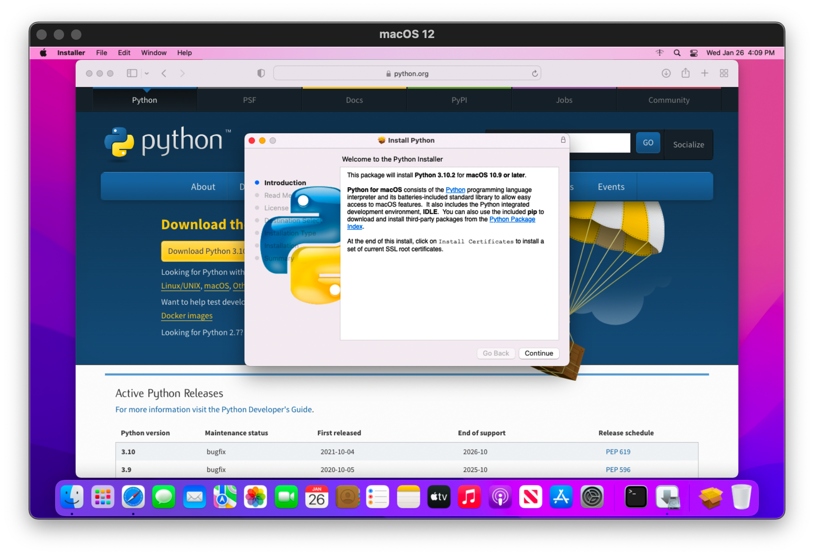

Click "Continue".

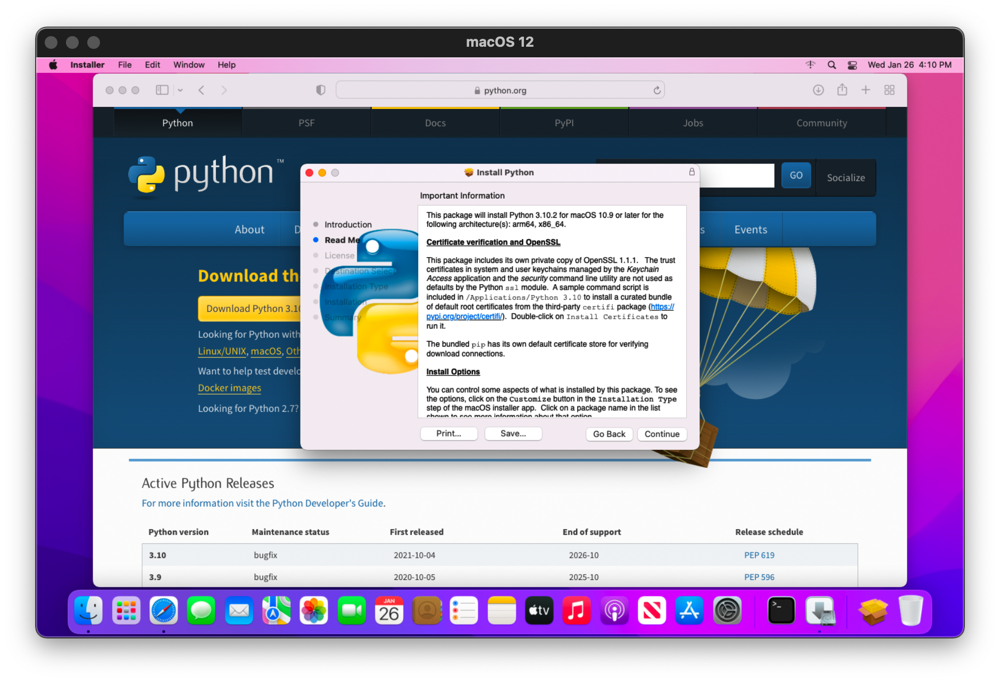

Click "Continue".

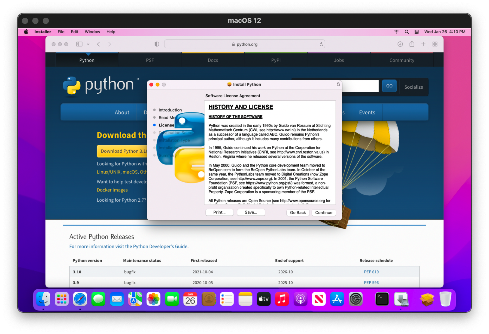

Click "Continue".

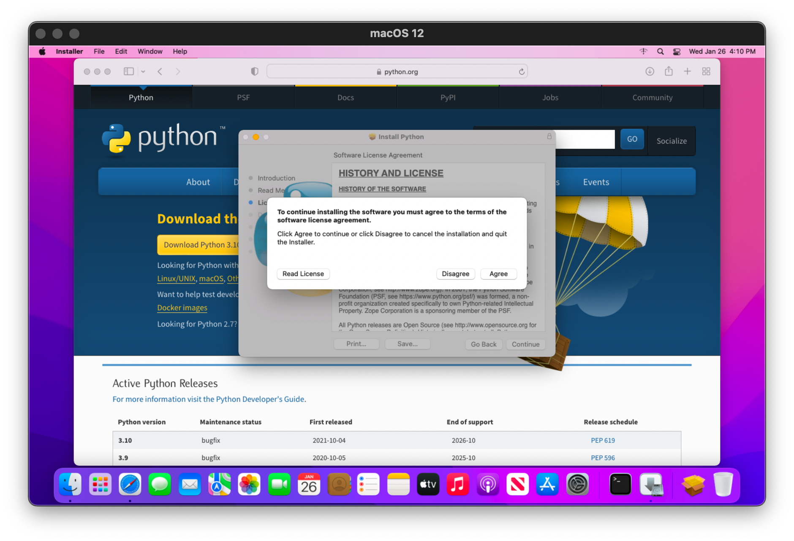

Click "Agree".

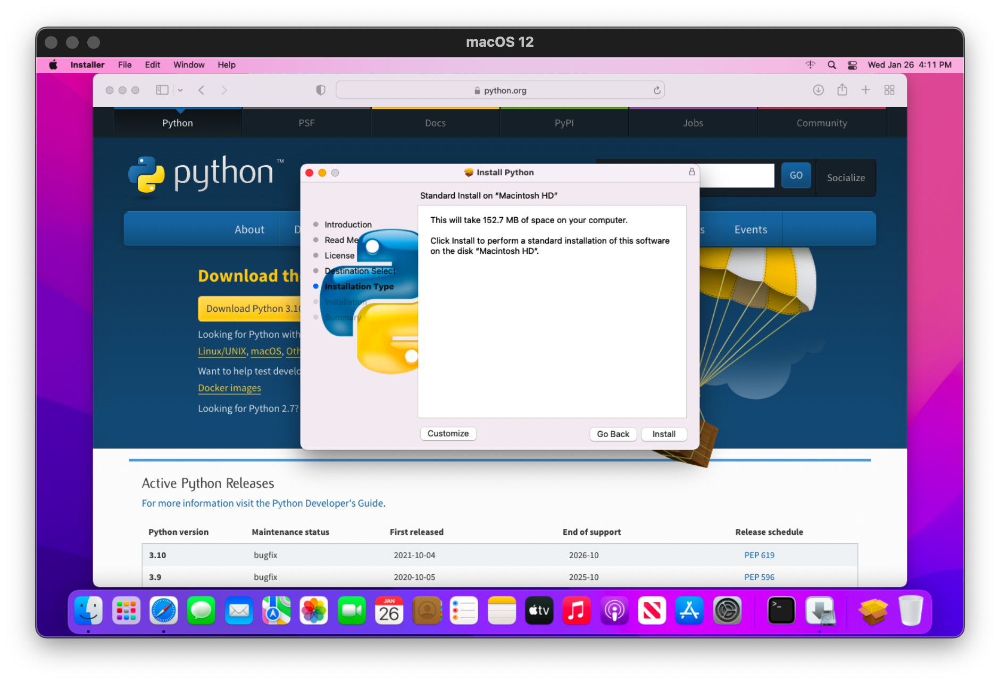

Click "Install".

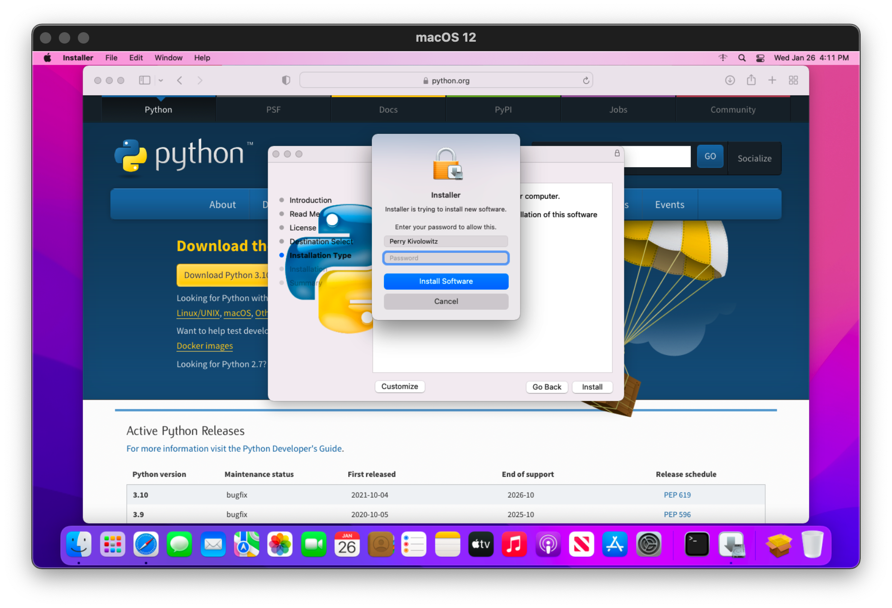

Enter your password and click "Install Software".

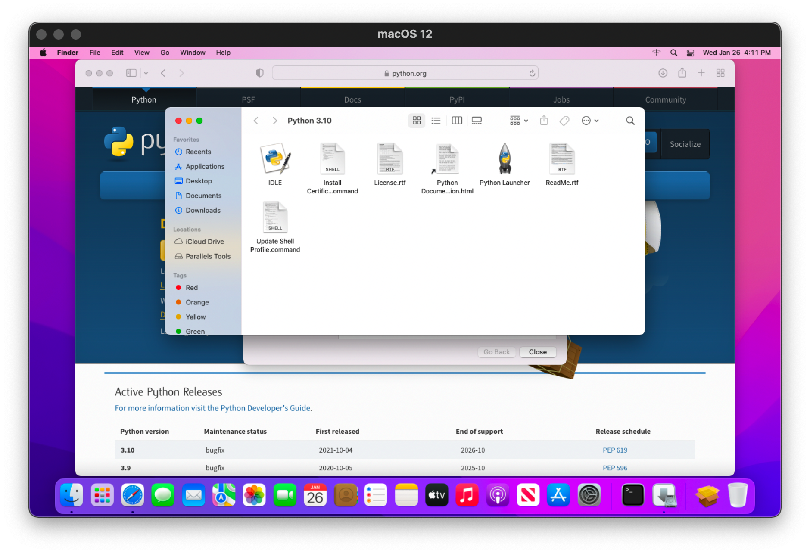

Python is now installed. Open your "Terminal".

Run both of the following commands. They should produce output as shown in the next image.

```text
python --version
python3 --version
```

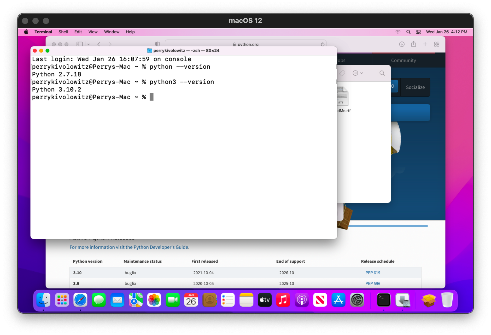

### python3 versus python

It is very likely you will need to explicitly execute `python3` rather than `python`. Same for `pip` - you must use `pip3`.

### Verify `pip` is installed

Enter `pip3 --version` into the Terminal and hit enter. 

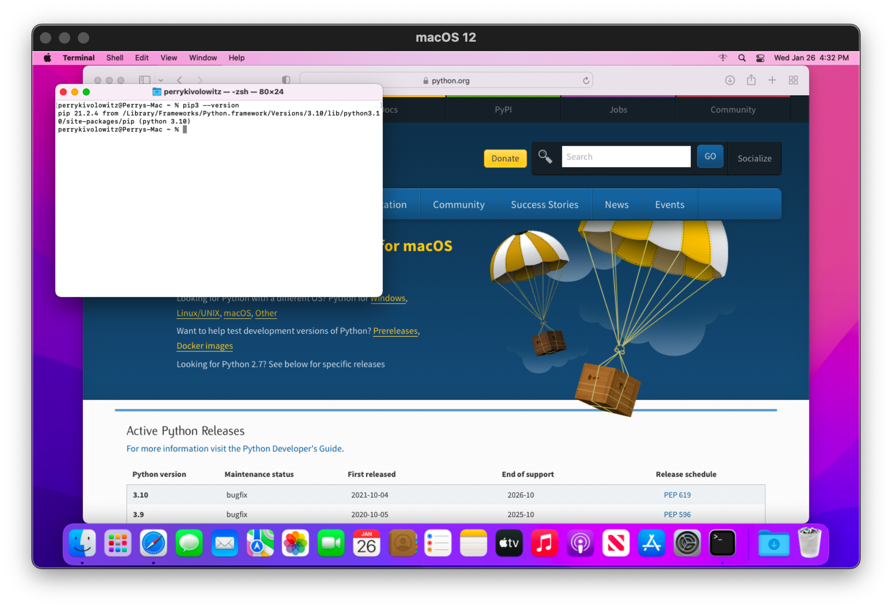

### Python modules first time setup

1. Paste `python3 -m pip install --upgrade pip setuptools wheel` and hit enter. Alert instructor if the last line printed does not include "Successfully".

2. Paste `pip3 install PyPl` and hit enter. Alert instructor if the last line doe snot include "Successfully"

3. Paste `pip3 install scipy scikit_image` and hit enter. Alert instructor if the last line doe snot include "Successfully"

4. Paste `pip3 install mutagen matplotlib` and hit enter. Alert the instructor if the last line does not include "Successfully".

## Install Visual Studio Code

Use this [link](https://code.visualstudio.com/docs/?dv=osx). You will be downloading the Visual Studio Code package for MacOS.

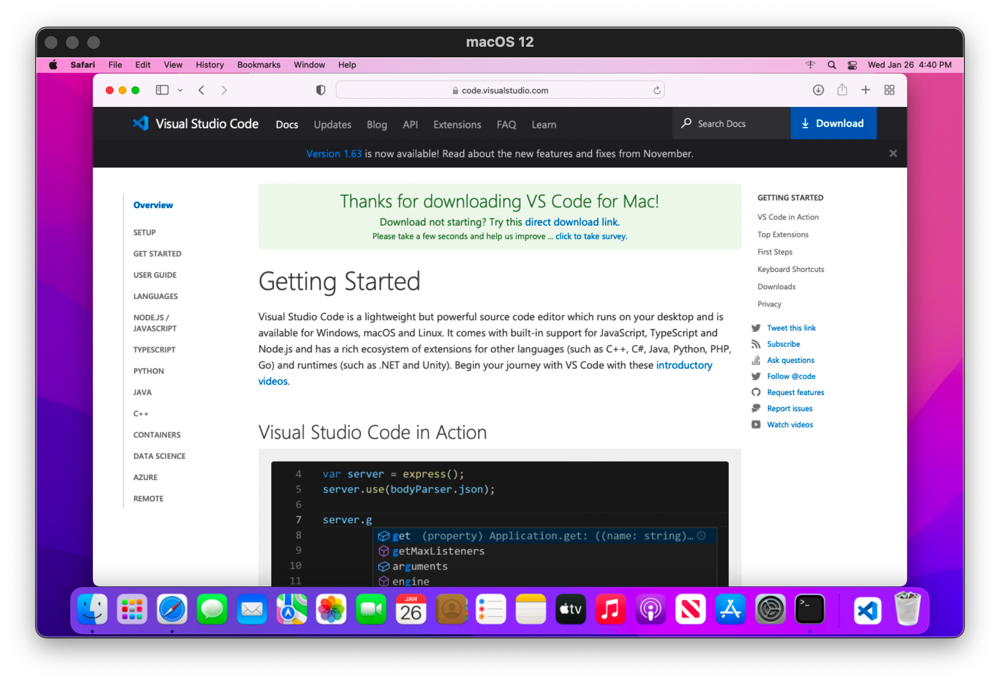

When you try to open it in Catalina it will fail. Why? Because Steve Jobs.

If this happens:

1. go to Preferences --> Security and Privacy.
2. At the bottom of the dialogue, unlock the settings by clicking on the padlock and enter your password.
3. Click on "Allow apps downloaded from: App Store and identified developers."
4. Run the Visual Studio Code install again. This time you will have the chance to "Open".
5. After verifying that you can run Visual Studio Code, you need to move it from your Downloads directory to your Applications folder. In the Finder, right click on Visual Studio Code and select "Copy Visual Studio Code".
6. Click on Applications, and paste. You should hear a stupid 1980's sound.
7. Use Spotlight Search now, to confirm your Visual Studio Code is in the right place. Run Visual Studio Code.
8. Assuming it is now running, right click on its Dock icon. Select Options --> Keep in Dock.

### Move Code to Your Applications

VS Code is presently in your Downloads folder. Move it yo your Applications folder.

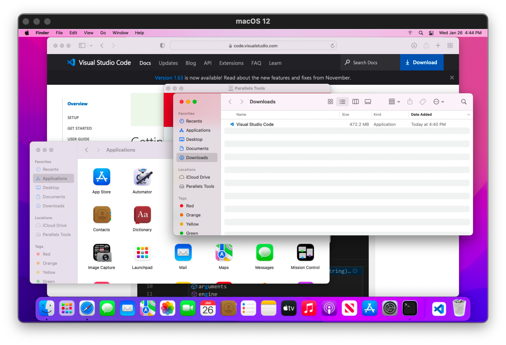

### Allow VS Code to be Launched From the Terminal

With VS Code open, type `↑+⌘+P` - shift command p.

In the text box, type `shell` you should see `Shell Command: Install 'code' command in PATH`.

Select it.

You should see a dialog at the bottom of the screen which says `Shell command 'code' successfully installed in PATH'. You may have needed to enter your password (if asked).
