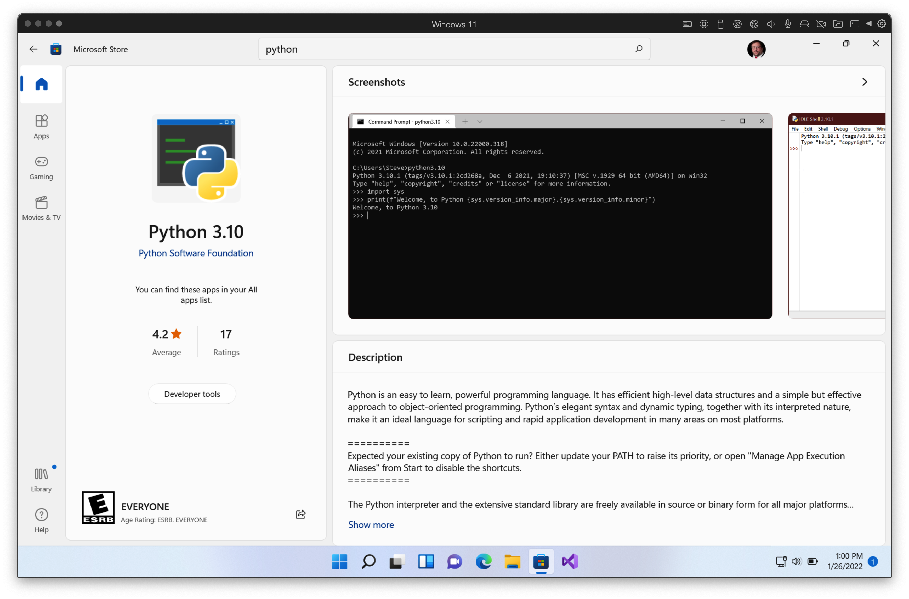
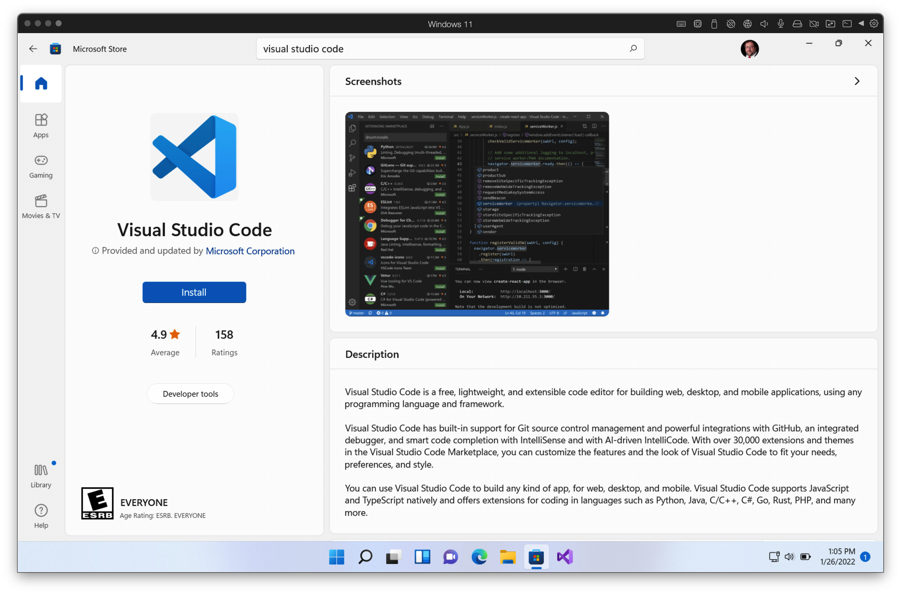
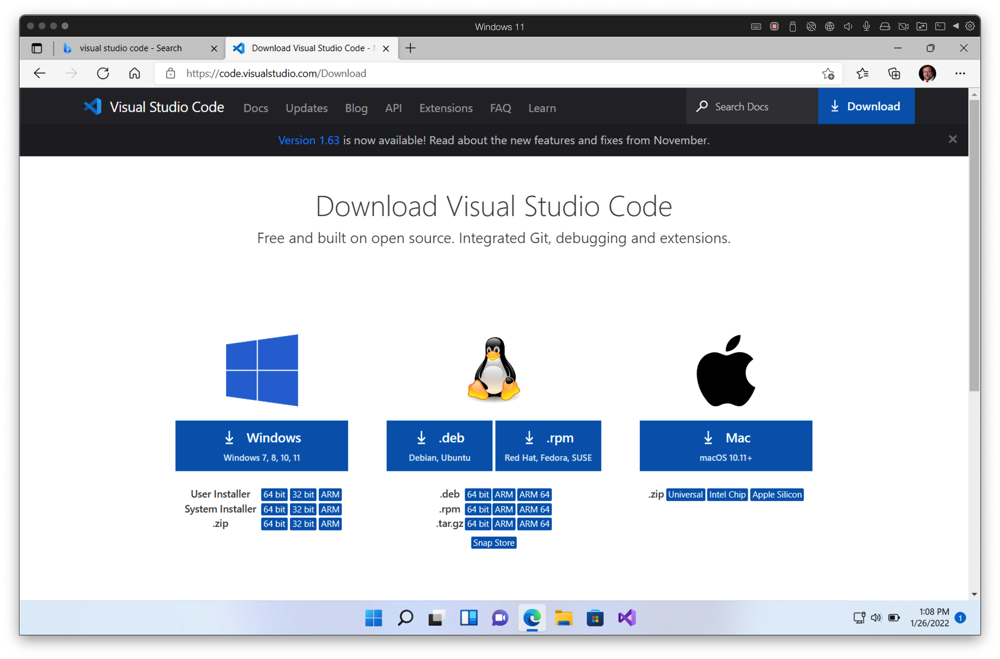

# Installation Instructions for Windows

## Python

Installation of Python on a current Windows 10 or 11 system is made easy via the Microsoft Store. Search for Python to find Python 3.10.

After installing, confirm the version (and installation) by:

1. **Press Windows Key**
2. **Type "cmd" and enter. This is your "command prompt" - we will use it alot.**
3. Type `python --version`
4. You should see `Python 3.10.2` or another numeric value indicating a different version. The first two numbers must be "3.10".

## VS Code

Visual Studio Code (NOT VISUAL STUDIO) will be our editor.

If, for reasons known only to Bill Gaits, the Microsoft Store refuses to work, search for Visual Studio Code online:

Download and install the "user installer" - clicking the "64 bit" is usually the right choice unless your machine is very old (then choose "32 bit") or is an ARM-based Windows machine (then choose "ARM").

Upon the first time we load or save a python file, you will be asked if you want to install the recommended extensions for Python. Do so.

## Python modules first time setup

1. Enter command prompt if not already in it (see above if unsure how)
2. Type `python -m pip install --upgrade pip setuptools wheel` and hit enter. Alert instructor if the last line printed does not include "Successfully".
3. Type `pip install PyPl` and hit enter. Alert instructor if the last line does not include "Successfully"
4. Type `pip install scipy scikit_image mutagen matplotlib` and hit enter. Alert instructor if the last line does not include "Successfully"
